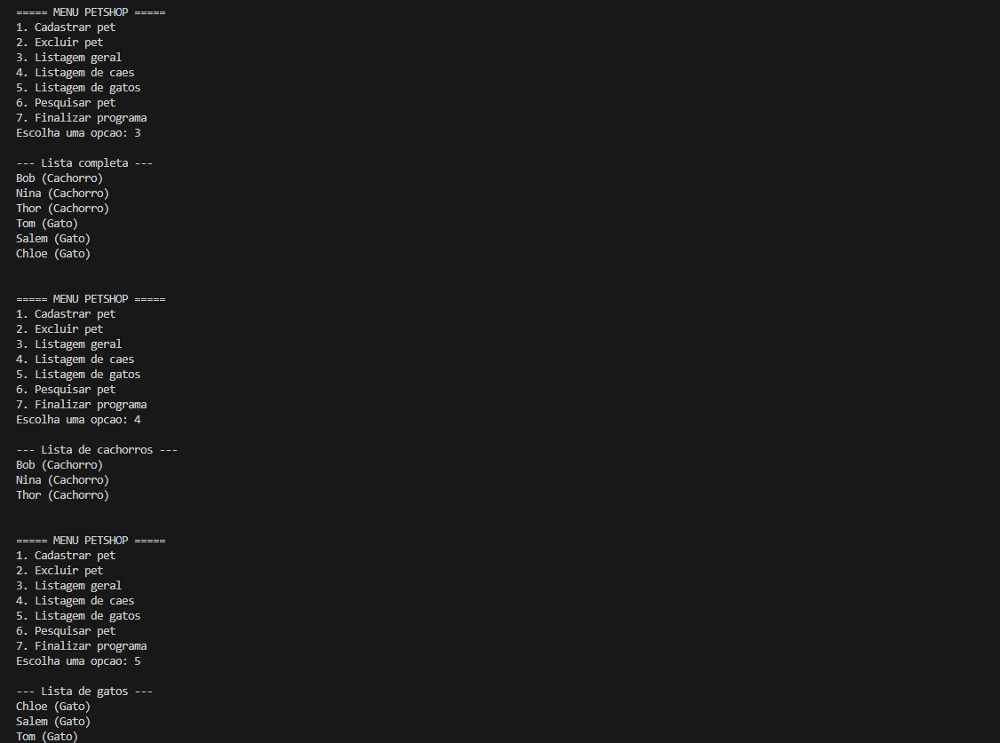

# Estrutura de Dados - Lista Duplamente Encadeada

Este repositório contém uma implementação de uma **lista ordenada duplamente encadeada** em C++, desenvolvida como parte de uma atividade da disciplina de **Estrutura de Dados**.

---

## Exercício: Lista Ordenada Duplamente Encadeada

### Descrição

Seguindo o paradigma da **Orientação a Objetos**, implemente uma classe e o programa principal para a seguinte situação:

> Implemente um programa para gerenciar os pets de um canil. Serão armazenados os seguintes dados:
> - Nome do Pet  
> - Tipo do Pet:
>   - Cão  
>   - Gato  
> - Idade  
> - Raça  

Os dados devem ser armazenados em uma **lista ordenada duplamente encadeada**.

---

### Menu de Opções

O programa deverá apresentar o seguinte menu:

1. Cadastrar Pet  
2. Excluir Pet  
3. Listagem Geral  
4. Listagem de Cães  
5. Listagem de Gatos  
6. Pesquisar  
7. Sair  

---

### Estrutura do Projeto 📁

├── src/

      └── listapets.cpp
      └── main.cpp

  
├── include/

      └── listapets.h

├── img/

      └── (imagens usadas no projeto)
     
├── .gitignore

├── README.md

---

## 📋 Exemplo de Uso da função listar

